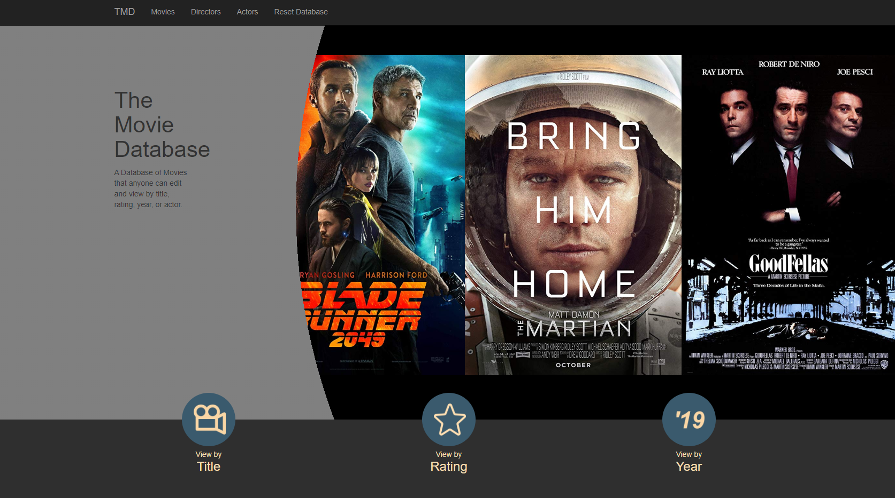

# TheMovieDatabase

An ASP.NET MVC application that I'm currentely working on that archives data about popular movies.
If cloning the connection string in the dbConnection method in the BaseController will probably need to be modified to access the database.

